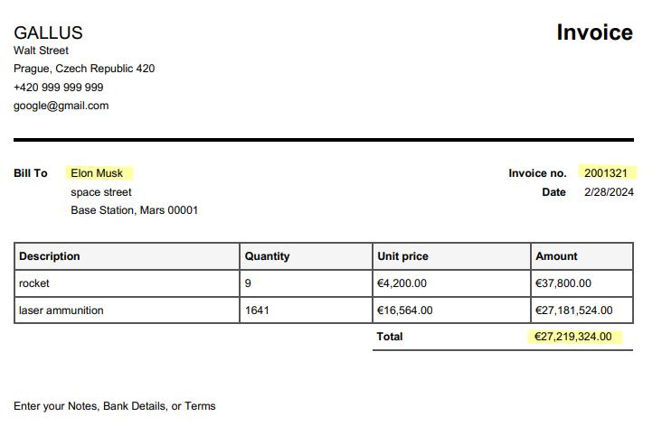

# Simple Template Based Intelligent Document Processing

This is a lightweight command-line application designed for automating the processing of diverse documents, including
invoices, transactional documents, package listings, and more.

This application is capable of automating information extraction from documents that adhere to a template structure.
Users have to manually extract relevant information from just a single document, marking the specific areas of interest
along with their bounding boxes. Subsequently, for any other documents with a similar structure and information
placement, the application extracts the specified data.

<!-- GETTING STARTED -->

## Getting Started

### Installation

1. Clone the repo
    ```bash
   git clone https://github.com/adam-osusky/idp.git
   cd idp/
    ```
2. Install model data for Tesseract OCR
    ```bash
    mkdir tessdata
    wget https://github.com/tesseract-ocr/tessdata/raw/main/eng.traineddata -P ./tessdata
    ```
3. Tesseract OCR looks for model data in `$TESSDATA_PREFIX` variable. So set the variable to the path where you
   stored the model data in the previous step.
    ```bash
    # in your .bashrc
    export TESSDATA_PREFIX=<path-to-cloned-repo>/tessdata
    ```
4. Run Maven install
   ```bash
   mvn clean install
   ```
5. Execute the program. For right usage and info about arguments refer to the usage section.
   ```bash
   mvn exec:java
   ```

## Usage

The usage is as follows. Initially, you manually extract data from your base template document. You need to obtain the
bounding box of the area containing relevant information. For instance, consider this document `imgs/idp-template.jpg`:

<div style="text-align: center;">
  
</div>

Assume that interesting information from this document is highlighted by a yellow marker. The name next to "Bill to" is
in a bounding box area with coordinates`left=122, top=229, right=185, bottom=239`.

Other interesting information includes the invoice number and total price. These items have bounding
boxes: `left=713, top=229, right=761, bottom=239` and `left=655, top=418, right=745, bottom=430` respectively.

Now, for another document with the same template, we want to extract the information. The second document
is `src/test/java/cz/cuni/mff/idp/testdata/gallus-invoice-2.pdf`:

<div style="text-align: center;">
  
</div>

We need configuration json which tells the application where to extract. For this the configuration is
in `src/test/java/cz/cuni/mff/idp/testdata/example-configuration.json`:

```json
{
  "targets": [
    {
      "variable_name": "recipient_name",
      "page": 1,
      "left": 122,
      "top": 229,
      "right": 185,
      "bottom": 239
    },
    {
      "variable_name": "invoice_id",
      "page": 1,
      "left": 713,
      "top": 229,
      "right": 761,
      "bottom": 239
    },
    {
      "variable_name": "total_amount",
      "page": 1,
      "left": 655,
      "top": 418,
      "right": 745,
      "bottom": 430
    }
  ]
}
```

The configuration includes a key for the page. If documents have multiple pages, specify from which page the extraction
should be executed.

Extraction can be done with the following command:

```bash
 mvn exec:java -Dexec.args="src/test/java/cz/cuni/mff/idp/testdata/example-configuration.json 100 src/test/java/cz/cuni/mff/idp/testdata/gallus-invoice-2.pdf out.json"
```

Where the arguments are: `<config> <dpi> <file-to-extract> <output-path>`. The output path is where the output JSON is
stored. DPI (dots per inch) must be the same as the original
template document from which you manually obtained bounding boxes.

The resulting `out.json` looks like this:

```json
{
  "1": [
    {
      "variable_name": "recipient_name",
      "page": 1,
      "extracted": "Bill",
      "left": 122,
      "top": 229,
      "right": 138,
      "bottom": 239
    },
    {
      "variable_name": "recipient_name",
      "page": 1,
      "extracted": "Gates",
      "left": 142,
      "top": 229,
      "right": 176,
      "bottom": 239
    },
    {
      "variable_name": "invoice_id",
      "page": 1,
      "extracted": "1616516",
      "left": 714,
      "top": 229,
      "right": 763,
      "bottom": 239
    },
    {
      "variable_name": "total_amount",
      "page": 1,
      "extracted": "€2,901,086.00",
      "left": 655,
      "top": 418,
      "right": 738,
      "bottom": 430
    }
  ]
}
```

It successfully extracted the information. Two words have the class "recipient_name," and all three classes are in the
key "1", indicating extraction from page number 1. If there were extractions from multiple pages, the respective
extractions would be in their respective key. There is also information of their bounding boxes.